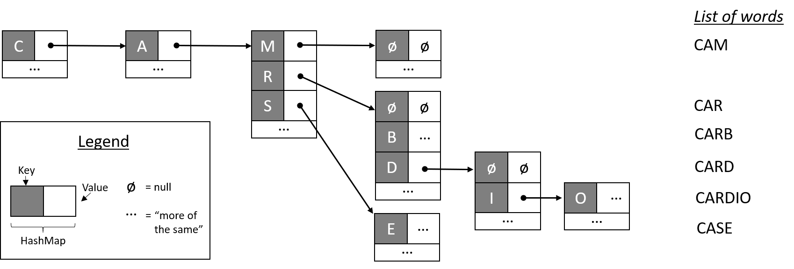

# HashMap-Intellisense
Computational Problem Solving in the Information Domain III, Homework create a word suggestion program parsing a list of words from an unabridged dictionary into a HashMap.

User inputs a letter and the program displays the next possible letters

## Structure of the HashMap Dictionary


## Run 
Navigate to the code/ folder

Run and compile with 

```
javac *.java && java StackIntellisense
```
